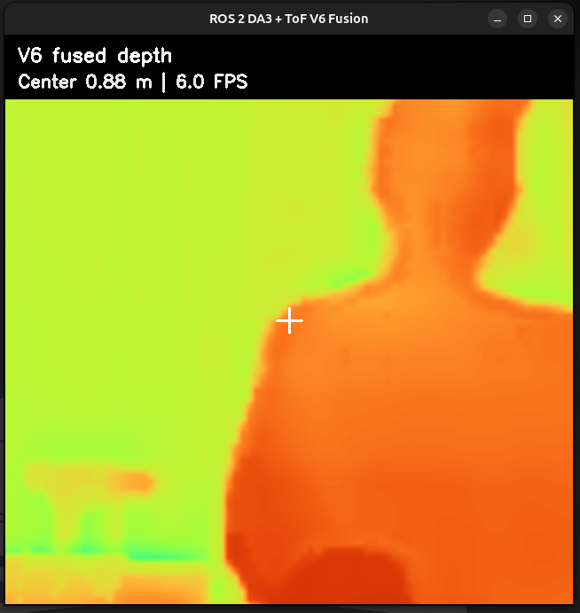
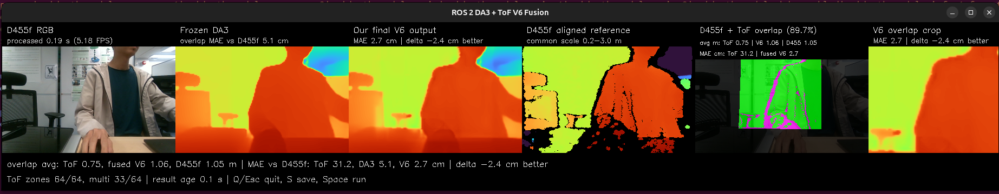

# 项目进度报告：轻量级 ToF–RGB 稠密深度融合

| 报告信息 | 内容 |
|---|---|
| 日期 | 2026 年 9 月 30 日 |
| 当前阶段 | ROS 2 研究原型已完整运行；V6 仍需在全新场景中做最终泛化测试 |
| 硬件 | Intel RealSense D455f + VL53L5CX 8×8 多区域 ToF 传感器 |
| 用途 | 项目进度评审与可复现交接 |

## 项目摘要

本项目研究一个问题：分辨率很低的 ToF（Time-of-Flight，飞行时间测距）传感器，能否
改善单张 RGB 图像生成的稠密深度图？Depth Anything 3（DA3）可以预测每个像素的深度，
因此物体形状和空间细节较好，但绝对距离可能不准。VL53L5CX 只有 8×8，也就是 64 个
测量区域，不过它在测量有效时可以提供真实距离。我们的目标是结合两者的优点，同时把
需要训练的融合网络保持在较小规模。

目前，完整研究原型已经在 ROS 2 Jazzy 中运行。D455f 和 VL53L5CX 已经固定和标定；
最新 STM32 固件在保留每个区域最多四个距离返回的同时，通过带 CRC32 校验的二进制
协议以 10 Hz 发布数据。现有数据集包含 98 次兼容的真实采集，并按照 manifest 中的定义
归入 48 个场景组。冻结的 DA3 提供稠密深度先验，V4 负责局部 RGB–ToF 融合，V6 再对
多距离和边界区域做逐像素选择。D455f 对齐深度只作为训练和评估参考，在实际推理时不会
输入 DA3、V4 或 V6。

在重复使用的 15 张开发数据上，DA3 的全图平均绝对误差（MAE）为 13.89 cm，V4 将其
降低到 10.79 cm，V6 进一步降低到 10.67 cm。V6 的全图提升较小，但在 ToF 覆盖区和
多距离区域更明显。新的 ROS 2 实时系统已在笔记本的 Intel 核显上运行。ToF ROS 主题
实测为 10.14 Hz；融合输出正常稳定运行时约为 5 FPS。一次 30 秒测量的平均值为
4.51 FPS，原因是其中出现了一次 1.46 秒的 XPU 推理停顿。必须区分这两个速度：ToF
数据达到 10 Hz，不代表串行执行的 DA3 与 V6 整条融合流水线也能达到 10 FPS。

当前结果说明 ToF 信息确实有帮助，但系统还没有达到 D435i 或 D455 深度相机的水平。
现在最重要的工作是使用完全没有参与训练和调参的新场景，对冻结后的 V6 做公平测试。
实时观察中，V6 在全图上只比冻结 DA3 稍好，这与量化结果一致，也说明下一版本需要更强
的特征级 ToF 融合，而不是继续小幅调整现有权重。本次运行时升级改善了数据传输、显示
流畅度和系统可维护性，但没有改变之前报告的模型精度结果。

### 相比 9 月 28 日报告的主要更新

- 实时程序已拆分为 ROS 2 相机、串口、融合和显示节点。
- VL53L5CX 固件现在能以实测 10.11–10.14 Hz 输出 8×8、每格四目标的数据。
- 默认部署画面新增正方形融合区域和中心距离；可选参考模式保留 D455f 对比和重叠区域 MAE。
- ToF prompt 构建时间从约 903 ms 降低到 47 ms，逐像素输出保持等价。
- Intel XPU 上稳定融合速度约为 5 FPS；由于偶发推理停顿，30 秒平均值为 4.51 FPS。
- 自动化测试从 105 项增加到 116 项，全部通过。

## 1. 研究问题与动机

单目稠密深度和轻量级 ToF 具有互补优势：

- **DA3 稠密深度：** 空间分辨率高，能较好地表达物体结构和边缘，但绝对尺度和距离
  可能不准确。
- **VL53L5CX ToF：** 直接输出公制距离，但只有 64 个区域；在物体边界附近还可能同时
  得到前景、背景或无效返回。

因此，本项目的核心研究问题是：

> 能否使用稀疏的多距离 ToF 测量，修正预训练 RGB 深度模型，同时避免重新训练一个
> 大型深度网络？

本项目受到 DELTAR 的 RGB–ToF 学习式融合，以及 prompt-based depth（提示式深度）
方法的启发。不过，目前的 V4/V6 是我们设计的轻量外部融合结构，不是对 DELTAR 或其他
论文的完整复现。

## 2. 当前系统流程

```text
D455f RGB（30 FPS）──> 冻结 DA3 ──> 稠密公制深度先验 ──────┐
                                                             │
VL53L5CX ──> STM32 二进制串流 ──> ROS /tof/frame ──> 滚动窗口 │
──> 质量筛选 ──> RGB 投影 ──> 缓存 prompt ─────────────────┤
                                                             ▼
                                                    V4 局部融合网络
                                                             ▼
                                                    V6 逐像素路由器
                                                             ▼
                            稠密 V6 深度 + 融合 mask + 正方形裁剪
                                                             │
                                                             ▼
                                                       中心距离估计

D455f 对齐深度 ──> 只作为可选训练/评估参考
```

部署时的输入只有 RGB 和实时 VL53L5CX 数据。D455f 深度不会输入模型，这一点非常重要，
因为它可以证明最终输出确实来自 DA3 与 ToF 的融合，而不是参考相机在后台直接给出答案。
融合 mask 由有效的 ToF 投影覆盖区和有效 V6 深度共同确定。启用 D455f 参考评估时，
D455f 中为 0、NaN 或其他无效的像素不会被当作 0 米，而是直接从 MAE 计算中排除。

## 3. 已完成的工作

### 3.1 硬件安装与空间标定

- D455f 和 VL53L5CX 已固定在同一刚性支架上。
- 从装置背面看，ToF 大约位于 RGB 相机中心左侧 1.3 cm、上方 3 cm，并后退约 1 cm。
- 通过左右、上下和偏心目标实验，确认 ToF 原始网格需要逆时针旋转 90° 后再投影到
  RGB 图像。
- 使用多个姿态的平面数据，估计 ToF 视场角和相对刚体变换。
- 在独立斜平面检查中，映射 MAE 从 5.42 cm 降低到 1.45 cm。
- 数据采集程序已经处理相机/串口被旧进程占用、重新连接和安全退出等问题。

目前网格方向已经可靠，但每个 ToF 区域的真实光锥、镜头畸变和遮挡关系仍可能产生误差。

### 3.2 ToF 固件与原始信息保留

ToF 固件已经从简单的单距离输出，升级成结构化的多目标格式。在 8×8 分辨率下，每个
区域可以保存最多四个原生距离返回，同时保存：

- 目标数量和状态；
- `sigma`，即传感器报告的距离不确定度；
- 信号强度、环境光和反射率；
- 在可用情况下保存传感器温度和时间信息。

这些信息在物体边界特别重要。一个 ToF 区域可能同时看到近处物体和远处背景，如果把
多个返回直接平均，就会丢失真正有用的前景/背景信息。

最新固件和传输配置如下：

- VL53L5CX 以 10 Hz 测距，integration period 为 15 ms；
- 每个 8×8 帧包含四次积分，并保留每格四个目标槽位；
- STM32L476 使用 32 MHz MSI 时钟；
- I²C 使用约 1 MHz Fast-mode Plus；
- UART 使用中断发送，波特率为 1,000,000；
- 每个 `TOF4_BINARY_V1` 数据帧为 2,896 bytes，并带 CRC32；
- 主机端支持 CRC 检查、自动重新同步，同时兼容旧文本协议。

开发板原始串口实测 15 秒收到 151 帧，即 10.109 Hz；ROS 2 `/tof/frame` 实测为
10.11–10.14 Hz。刷写前已经备份完整的 1 MiB MCU Flash 和原始 STM32 工程。升级前
Flash 的 SHA-256 为
`ad953313b21901c84e538c2410e44d412a8aed2d1392d5426ec2d234f6412cdb`；最终 10 Hz
固件 binary 的 SHA-256 为
`cdc9c104ca77cc61fac771d0265f1b2ad6bad625a05e5d08200fdb555c05f629`。

### 3.3 数据采集与训练数据准备

当前真实数据集包含 **98 次互不重复的兼容采集，并按照 manifest 定义归入 48 个场景组**。
这个数字已经根据全量拟合使用的八个真实数据 manifest 重新核对：标定与早期融合数据为
28 次采集、10 个组；三套各 15 次采集的开发数据合计 45 次、15 个组；其余标定与映射
数据为 25 次采集、25 个组。最后一部分有两个组名也出现在第一部分，因此唯一组名总数
是 48，而不是把各部分直接相加得到的 50。

这里的“场景组”是数据集划分标签，通常由采集名称去掉重复编号后得到，不能直接理解为
48 个完全独立的房间或物体布置。部分标定组使用同一装置或标定板，只是距离、位置或姿态
不同。数据内容包括平面板、两层与三层距离、小物体、暗色物体、椅子、斜墙和偏心目标。
重要场景尽量重复采集，目的是测量稳定性，而不是只挑选一次表现最好的结果。

训练流程还使用了 **200 张公开 DIODE RGB-D 图像**。我们从公开的稠密真实深度中模拟
8×8 多距离 ToF，并使用真实 VL53L5CX 的统计特征校准模拟器。公开数据可以增加场景
多样性，但无法完全模拟真实传感器的多径干扰、反射率失败和边界混合，因此真实采集仍然
是必要的。

每个训练样本包含 RGB、冻结 DA3 深度、D455f 参考深度、有效区域 mask、投影后的 ToF
候选距离以及传感器质量信息。同一个物理场景的重复采集会作为一组处理，以减少
train/validation leakage（训练和验证数据泄漏）。

### 3.4 模型与实验路线

项目实现并比较了多种方法：

- **几何比例修正：** 在简单平面上有效，但在混合深度边界会把前景距离错误传播到背景。
- **V1/V2 adapter：** 引入学习式残差修正和显式 ToF 候选选择。
- **V3/V3-B attention 与 decoder prompt：** 表达能力更强，但在小规模真实数据上出现
  跨场景过拟合。网络更复杂不代表泛化更好。
- **官方 DELTAR 复现：** 成功运行论文作者发布的模型，但由于训练域、传感器和输入格式
  与本装置不同，直接迁移效果较差。
- **V4 直接融合：** 保留 RGB patch 与物理 ToF 区域的对应关系，从真实传感器返回中
  选择距离，并通过图像特征传播信息，共有 **599,476 个可训练参数**。
- **V5 DA3 特征消融：** 增加 167,088 个参数来使用冻结 DA3 decoder 特征，但没有超过
  V4，因此安全 checkpoint 仍保持为 V4。
- **V6 边界路由器：** 冻结 DA3 和 V4，增加 **11,691 个可训练参数**。它为 ToF 覆盖
  区内的每个像素选择：保留 V4，或采用最多四个 ToF 返回中的一个。V4+V6 总可训练
  参数量为 **611,167**。

实验得到的核心结论是：仅仅保留多个 ToF 距离还不够。真正困难的是
**candidate-to-pixel assignment（候选距离到 RGB 像素的分配）**，也就是判断一个大
ToF 区域里的每个 RGB 像素究竟属于哪个物理距离层。

### 3.5 ROS 2 部署与运行时优化

实时系统已经重构为 ROS 2 Jazzy 流水线，各节点职责如下：

- RealSense 节点发布 D455f RGB；需要参考评估时才启用对齐深度；
- 串口节点解析带 CRC 的 ToF 数据，并发布 `/tof/frame`；
- 融合节点运行冻结 DA3，构建或复用最新 ToF prompt，执行 V4/V6，并发布深度、mask、
  裁剪图和中心距离；
- 显示节点订阅默认融合裁剪图，或可选的六面板参考图。

相机推理不再由 ToF 到达时刻直接驱动。Prompt 在独立任务中准备，新 prompt 尚未完成时
继续复用上一份有效结果。默认每五个 ToF 帧重建一次，即在 10 Hz 固件下约为 2 Hz。
这样可以让融合画面持续输出，但快速移动的新物体最多可能需要约 0.5 秒才反映到 prompt。

已验证的运行时优化包括：

- prompt 栅格化从约 903 ms 降到 47 ms；单元测试确认深度、概率、置信度、有效 mask 和
  传感器质量通道逐像素等价；
- ToF prompt tensor 缓存在 Intel XPU，并通过原位复制更新；
- 只有存在订阅者时才序列化较大的 ROS 图像消息；
- 正常启动时降低 DA3 重复日志；
- 串口节点和融合节点增加安全退出保护，避免重复 shutdown 错误。

这些优化没有修改 checkpoint 权重、DA3 处理分辨率或 V6 的空间输入大小。

## 4. 主要量化结果

MAE 表示平均绝对误差，数值越低越好。

### 4.1 重复使用的复杂开发集

下面的 15 张数据来自互相分离的复杂场景组，但它们已经参与模型结构和阈值选择，因此
只能作为开发证据，不能被称为无偏的最终测试。

| 评估区域 | 冻结 DA3 | V4 | 校准后的 V6 |
|---|---:|---:|---:|
| 全部有效像素 | 13.89 cm | 10.79 cm | **10.67 cm** |
| ToF 覆盖区 | 11.28 cm | 5.84 cm | **5.48 cm** |
| ToF 覆盖区外 | 15.26 cm | **13.38 cm** | **13.38 cm** |
| 真实深度边界 | 32.12 cm | 30.82 cm | **30.28 cm** |
| 多候选距离像素 | 18.43 cm | 8.14 cm | **7.40 cm** |

相对 V4，V6 的全图 MAE 改善 1.15%，ToF 覆盖区改善 6.17%，边界改善 1.76%，多候选
区域改善 9.09%。按照安全设计，ToF 覆盖范围外的 V6 输出与 V4 完全相同。

### 4.2 使用全部已有真实数据的最终拟合

模型结构和门控阈值在开发阶段确定后，我们使用全部 98 张真实数据和 200 张公开数据训练
部署候选模型。因为这 98 张真实图都参与了优化，下面的数字只能证明训练流程正常工作，
不能用于证明模型对新场景的泛化能力。

| 98 张已见真实数据区域 | V4 拟合 | V6 拟合 |
|---|---:|---:|
| 全部有效像素 | 14.69 cm | **14.59 cm** |
| ToF 覆盖区 | 3.01 cm | **2.73 cm** |
| ToF 覆盖区外 | **20.74 cm** | **20.74 cm** |
| 真实深度边界 | 33.39 cm | **33.17 cm** |
| 多候选距离像素 | 3.71 cm | **3.26 cm** |

全图改善较小是可以解释的：8×8 ToF 只覆盖图像的一部分，而且安全门控在证据不确定时
会主动避免较大的修正。

## 5. 实时原型与性能测量

### 5.1 默认部署画面

默认 ROS 2 启动使用更快的纯融合路径，不启用 D455f 参考深度、对齐和 MAE。显示窗口只
展示有效 ToF 融合范围内的 V6 深度。程序取能够包含融合范围的最小正方形裁剪，不把它
拉伸成矩形，也不会为了填满面板而保留外部无效黑点。画面包含中心十字、11×11 区域的
中位数中心距离，以及实测输出 FPS。

主要运行主题如下：

- `/fusion/v6_fusion_crop_m`：显示窗口使用的正方形 V6 深度裁剪；
- `/fusion/v6_fusion_depth_m`：按 ToF 覆盖 mask 后的全分辨率 V6 深度；
- `/fusion/fusion_mask`：精确融合 mask；
- `/fusion/center_distance_m`：中心区域中位数距离。

### 5.2 六面板参考与重叠 MAE

可选参考模式显示六个同步面板，并发布 DA3、V4、V6、ToF、D455f 和重叠区域诊断。
MAE 只在所有所需数据都有效的重叠像素上计算。D455f 为 0、NaN 或其他无效距离的像素
会被忽略，不会被错误计算成很大的深度误差。

这里的融合范围属于 V6 与投影后的有效 ToF 覆盖。D455f 不决定是否融合，只在参考模式
中比较对应像素。

### 5.3 示例输出与读图方法

#### 默认融合画面



*图 1：正常融合模式的示例。正方形面板只显示有效 ToF 投影覆盖所对应的 V6 深度裁剪。*

读图方法如下：

- `Center 0.88 m` 表示白色十字周围 11×11 区域内有效 V6 深度的中位数。它不表示画面中
  整个人的所有像素都是 0.88 m。
- `6.0 FPS` 是截图时刻附近的显示/输出速度，属于瞬时运行值，不是后文 30 秒测试的平均值。
- 默认固定颜色范围为 0.2–3.0 m：红色和橙色表示较近，黄色和绿色表示中等距离，青色、
  蓝色和紫色表示较远。颜色表示距离，不表示置信度，也不表示物体类别。
- 原始相机图像是矩形，程序只裁出能够包含融合范围的最小正方形。因此，这个面板不能被
  理解为相机的完整视野。

#### 六面板参考画面



*图 2：参考模式中某一帧的示例。图中的 V6 MAE 2.7 cm 只是这一帧有效重叠像素的诊断值，
不是最终测试集结果。*

六个面板从左到右分别是：

1. **D455f RGB：** 输入冻结 DA3 的彩色图像。
2. **冻结 DA3：** 单目稠密深度基线；这一帧的重叠区域 MAE 为 5.1 cm。
3. **最终 V6 输出：** 融合后的稠密深度；这一帧的重叠区域 MAE 为 2.7 cm。
4. **D455f 对齐参考：** 使用相同 0.2–3.0 m 颜色范围显示参考深度。黑色像素代表参考深度
   无效，计算 MAE 时会被排除。
5. **D455f + ToF 重叠：** 绿色表示 ToF 投影与 D455f 深度都有效；洋红色表示 ToF 有效，
   但 D455f 没有有效参考深度。图中的 89.7% 表示有效 ToF 覆盖中同时具有有效 D455f
   参考深度的比例。
6. **V6 重叠裁剪：** 只显示有效评估范围附近的 V6 结果。

`delta -2.4 cm better` 的计算方式是 `V6 MAE - DA3 MAE = 2.7 - 5.1 = -2.4 cm`，因此
负数代表 V6 的误差更小。底部的平均距离（`ToF 0.75`、`V6 1.06`、`D455f 1.05 m`）不是
误差，而是有效重叠区域内的平均深度；旁边单独列出的 MAE 才表示与 D455f 的差异。一个
ToF 区域包含很多 RGB 像素，在前景与背景混合时，原始 ToF 的误差可能很大。正式结论必须
汇总预先定义的全新测试集，不能只选择表现较好的截图。

### 5.4 运行速度

旧 CPU 程序仍可作为历史基准：

- DA3 处理分辨率 504：每次更新约 3.3–4.0 秒；
- DA3 处理分辨率 252：每次更新约 0.5–0.8 秒。

当前 ROS 2 部署使用 `process_res=168`、160×120 V6 输入，并通过 PyTorch XPU 使用 Intel
核显。预热后，DA3-Large 单独推理约为 0.094 秒（XPU）或 0.262 秒（CPU）。完整流水线
更慢，因为 DA3 与 V6 串行执行，并且还包括预处理、tensor 传输、prompt 融合、resize
和 ROS 发布。

| 测量项目 | 结果 |
|---|---:|
| ToF 原始/ROS 主题速度 | 10.11–10.14 Hz |
| 正常稳定融合速度 | 约 5 FPS |
| 30 秒融合速度平均值 | 4.51 FPS |
| 该次测量最长停顿 | 1.46 秒 |
| 优化前 prompt 构建时间 | 约 903 ms |
| 优化后 prompt 构建时间 | 约 47 ms |

偶发长停顿仍与 DA3/XPU 执行相关。降低 prompt 更新频率并不能消除停顿，检查时内核也
没有记录 GPU reset 或 fault。因此，正确说法是系统正常稳定运行时约 5 FPS，而不是
保证 10 FPS 的融合系统。

当前实时画面中，V6 在全图上仍只比冻结 DA3 稍好。这与开发集数据一致：最明显的改善
集中在有效 ToF 区域和多距离返回区域，而不是平均分布在整张图像上。

## 6. 无效或表现不佳的方法及其意义

- 手工设计权重无法稳定地区分同一 ToF 区域内的前景和背景。
- 全局 attention 有时会破坏物理空间对应关系，并错误修正不相关区域。
- 数据量较小时，DA3 decoder prompt 出现过拟合，在冻结测试中无法可靠泛化到 ToF
  覆盖范围外。
- 增加冻结 DA3 decoder 特征没有改善 V4。
- 只使用模拟数据训练，无法良好迁移到真实 VL53L5CX。
- 如果没有良好的逐像素分配机制，即使保留四个 ToF 距离，提升也非常有限。

这些失败实验同样有研究价值，因为它们缩小了下一步的搜索方向。仅增加参数或训练轮数
不太可能解决问题；更准确的空间分配、边界监督以及模拟到真实数据的迁移更加重要。

## 7. 当前限制

1. **缺少全新的 V6 最终测试：** 当前最强 V6 数字来自开发或训练拟合结果。
2. **ToF 输入非常稀疏：** 64 个区域无法直接恢复精细 RGB 边界。
3. **混合深度区域：** 一个区域可能同时包含前景、背景和无效返回。
4. **标定与同步限制：** 已完成空间标定，但两个传感器没有硬件级同步，动态场景更困难。
5. **参考深度也有误差：** D455f 在遮挡、反射、细小物体和边界附近同样可能出现空洞。
6. **ToF 范围外修正有限：** 为保证安全，V6 在覆盖区外保持 V4 不变。
7. **还没有直接 D435i 对照：** 目前不能证明“达到 D435i 90% 性能”的目标。
8. **运行速度不完全稳定：** 稳定融合接近 5 FPS，但偶发 Intel XPU 停顿会降低长时间
   平均速度，原因仍需继续分析。
9. **Prompt 新鲜度存在折中：** 默认每五个 ToF 帧重建 prompt 可减少 CPU 负载，但
   新出现的移动表面最多可能延迟约 0.5 秒才反映到融合中。

## 8. 下一步计划

### 8.1 立即执行：冻结测试

保持当前 checkpoint 和置信度阈值不变，采集一批完全没有参与训练和调参的新测试场景：

- 细或倾斜的前景物体，以及更远的背景；
- 三个清楚分离的距离层；
- 小于一个 ToF 区域的小物体；
- 暗色物体和明亮/反射物体；
- 每个物理场景至少三个重复样本。

评估时需要分别报告全图、ToF 覆盖区、覆盖区外、深度边界和多返回区域。看到结果以后
不能删除表现差的场景，否则测试会产生选择偏差。

### 8.2 下一版本模型方向

如果冻结测试确认 V6 只能带来小幅提升，最有价值的结构升级是
**ToF-conditioned feature fusion（ToF 条件特征融合）**。它不再只对最终深度图做小修正，
而是让 ToF token 更早地引导高分辨率图像特征和轻量 decoder/传播网络。这一方向更接近
DELTAR 的学习式推理，同时仍可以冻结大型 DA3。

下一版本需要更多真实边界场景，并仔细处理模拟数据到真实数据的差异。H100 可以加速更大
的模型实验，但高质量数据和严格测试方法仍然比单纯增加算力更重要。

### 8.3 运行时工程

下一项部署工作是分析 DA3/XPU 执行中的偶发长停顿。任何加速方案都应同时比较 FPS 与
深度精度。降低 DA3 分辨率或更换小模型可能提高速度，但也可能损失小物体和边界质量，
因此应优先尝试不改变现有模型和分辨率的优化。

### 8.4 与 D435i 做同场比较

如果可以借到 D435i，应在相同静态场景和接近的时间进行采集，并统一到相同 RGB 坐标系。
只有这样，才能公平定义和计算“达到 D435i 90% 性能”这一目标。

## 9. 可复现文件与当前成果

本公开仓库目前主要保存项目文档。以下路径对应实际运行的本地完整工程，用于明确本报告
所使用的实现和 artifact；这些文件并非全部包含在当前文档仓库中。

### 9.1 模型与标定文件

- 最终 V6 checkpoint：  
  `outputs/plane_v1/prompt_adapter_v6_boundary_router_all98_deployment/checkpoint_calibrated.pt`
- Checkpoint SHA-256：  
  `9fd8a126696f0f1648785ac15f05f6e27385fb4f7e142b809fd62f8ce0834b2c`
- V6 模型：`src/prompt_adapter_v6.py`
- V6 训练：`src/train_prompt_adapter_v6.py`
- V6 推理：`src/run_prompt_adapter_v6.py`
- 实时对比和共享融合 worker：`src/live_v6_viewer.py`
- 映射配置：`config/tof_rgb_mapping_plane_v1.json`
- 环境说明：`DOCKER.md`

### 9.2 ROS 2 与固件文件

- ROS 2 融合包：`ros2_ws/src/d455_tof_fusion`
- ROS 2 消息包：`ros2_ws/src/d455_tof_msgs`
- 启动文件：`ros2_ws/src/d455_tof_fusion/launch/live_v6_pipeline.launch.py`
- 构建脚本：`scripts/build_ros2.sh`
- 运行脚本：`scripts/run_ros2_pipeline.sh`
- 加速器检查：`scripts/check_accelerator.sh`
- 10 Hz 固件源码：`firmware/stm32_tof_10hz`
- 最终固件：`firmware_builds/stm32_tof_10hz_4target_20260930.bin`
- 升级前恢复说明：`firmware_backups/pre_10hz_20260930/RESTORE.md`

当前代码库的 **116 个自动单元测试全部通过**。测试覆盖二进制分段读取、CRC 错误和
重新同步、旧文本协议兼容、四目标保留、只在重叠区计算 MAE、正方形裁剪，以及优化前后
prompt 栅格逐像素等价。

### 9.3 ROS 2 运行命令

首次运行或代码修改后构建：

```bash
./scripts/build_ros2.sh
```

关闭 RealSense Viewer 和旧进程，然后运行默认融合画面：

```bash
./scripts/run_ros2_pipeline.sh \
  port:=/dev/ttyACM0 \
  baud:=1000000 \
  device:=xpu \
  process_res:=168
```

如果存在 `/dev/serial/by-id/...` 稳定路径，应优先使用。启用 D455f 参考深度、重叠统计、
MAE 和六面板画面：

```bash
./scripts/run_ros2_pipeline.sh \
  port:=/dev/ttyACM0 \
  baud:=1000000 \
  device:=xpu \
  process_res:=168 \
  enable_reference_outputs:=true \
  viewer_topic:=/fusion/comparison
```

旧的非 ROS 实时程序也支持最新二进制协议：

```bash
PYTHONPATH=src .venv312/bin/python src/live_v6_viewer.py \
  --port /dev/ttyACM0 --baud 1000000 --device xpu --process-res 168
```

只有在开发板已经恢复旧 ASCII 固件时，主机才应改回 115200 baud。

完整的新设备上手、环境检查、构建、运行、录制和故障排查命令，请参阅
[新用户操作指南](NEW_USER_OPERATING_GUIDE.md)。

## 当前结论

项目已经从简单比例修正，发展成包含硬件、采集、标定、数据处理、模型训练、评估和实时
推理的完整 ROS 2 研究原型。10 Hz ToF 串流已经解除原先约 0.8 Hz 数据源造成的等待，
系统能够连续发布融合 mask、正方形 V6 深度裁剪和中心距离；Intel XPU 上的稳定融合速度
约为 5 FPS。稀疏 ToF 在有效覆盖范围内确实能够改善深度，多距离逐像素路由也能改善困难
区域。

不过，最新 V6 相对 V4 和冻结 DA3 的全图提升仍然较小，精细物体边界依然是主要弱点，
偶发 XPU 停顿也会影响长时间平均 FPS。因此，目前可以说系统已经完整运行，并得到了
有意义且可复现的研究结论；但在声称达到商业 RGB-D 相机水平之前，仍需要全新的未见
测试集、更强的特征级融合方法，以及进一步的运行时稳定性分析。
