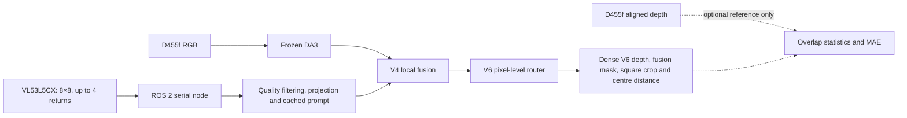

# Lightweight ToF–RGB Dense Depth Fusion

This repository documents a research prototype that combines frozen Depth Anything 3
(DA3) dense depth with an 8×8 multi-return VL53L5CX Time-of-Flight (ToF) sensor. The
system uses RGB structure from DA3 and sparse metric measurements from the ToF sensor to
produce a dense metric-depth map through lightweight V4 and V6 fusion networks.

Intel RealSense D455f depth is used only as an optional training and evaluation reference.
It is not supplied to DA3, V4, or V6 during deployment.

## Current status — 30 September 2026

| Component | Current state |
|---|---|
| RGB camera | Intel RealSense D455f, 640×480 at 30 FPS |
| ToF sensor | VL53L5CX, 8×8 zones, up to four returns per zone |
| ToF firmware | 10 Hz, CRC32-protected binary stream, 1,000,000 baud |
| Dense prior | Frozen DA3METRIC-LARGE |
| Fusion model | V4 local fusion plus V6 pixel-level boundary router |
| Runtime framework | ROS 2 Jazzy |
| Accelerated device | Intel integrated GPU through PyTorch XPU |
| Measured ToF topic rate | 10.14 Hz |
| Measured fused output | About 5 FPS during steady operation; 4.51 FPS over a 30-second test with one XPU pause |
| Automated tests | 116 passing tests |

The latest optimisation reduced ToF prompt raster construction from approximately 903 ms
to 47 ms while preserving pixel-equivalent prompt values. The runtime reuses the latest
valid prompt and rebuilds it every five ToF frames by default. This prevents the fusion
network from waiting for the sensor, although a newly moving surface may take up to about
0.5 seconds to affect the cached prompt.

## Deployment pipeline

The default ROS launch follows the faster deployment path and does not enable D455f depth
or MAE calculation. Reference outputs can be enabled for controlled evaluation. Invalid
D455f pixels are excluded from MAE rather than treated as zero distance.

## Viewer behaviour

The reference viewer can display six synchronised panels. Its sixth panel contains only
the V6 depth within the valid ToF fusion footprint. It uses the smallest square crop that
contains this footprint and displays the crop without stretching. The panel also reports
the median distance in an 11×11 centre region.

The fusion mask is based on valid projected ToF coverage and valid V6 depth. D455f depth
does not define the fusion result; it is added only when reference statistics are requested.

## Documentation

- [New user operating guide](NEW_USER_OPERATING_GUIDE.md) — hardware checks, build and
  launch commands, viewer modes, ROS topic checks, recording, safe shutdown and common
  troubleshooting.
- [Latest English project report](PROJECT_PROGRESS_REPORT.md) — full architecture,
  calibration, data, model history, quantitative results, runtime pipeline, limitations,
  and reproducibility notes.
- [Latest Chinese project report](PROJECT_PROGRESS_REPORT_ZH.md) — the updated Chinese
  version covering the same hardware, ROS 2 pipeline, measurements, limitations and
  reproducibility information.

## Scientific scope

The current results show that sparse ToF information can improve depth within its valid
coverage, particularly in multi-return regions. They do not show that the system is equal
to a commercial RGB-D camera. The strongest V6 numbers still come from development or
fitting data, so a strictly untouched test set remains necessary before making a final
generalisation claim.
